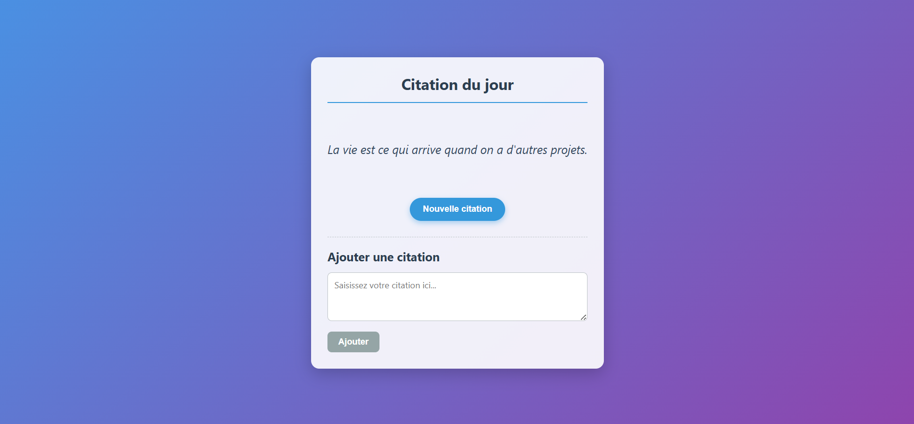

# Application de Citations du Jour

Cette application est composée d'un backend Node.js avec Express et d'un frontend React. Les deux services sont conteneurisés avec Docker et disponibles sur Docker Hub.


## Images Docker

Les images sont disponibles sur Docker Hub :
- Backend: `boussad1ait/quotes_backend:v2`
- Frontend: `boussad1ait/quotes_frontend:v2`

## Fonctionnalités

- Affichage d'une citation aléatoire
- Navigation entre différentes citations
- Ajout de nouvelles citations
- Interface utilisateur réactive avec animations

## la capture d'écran



## Téléchargement des images Docker

Pour télécharger les images Docker sur votre ordinateur local, utilisez les commandes suivantes :

```bash
# Télécharger l'image du backend
docker pull boussad1ait/quotes_backend:v2
```
```bash
# Télécharger l'image du frontend
docker pull boussad1ait/quotes_frontend:v2
```
```bash
# Vérifier que les images ont bien été téléchargées
docker images | grep boussad1ait
```
## Après le téléchargement des images

Après avoir téléchargé les images Docker, vous pouvez facilement déployer l'application complète avec Docker Compose que j'ai partager 

Ouvrez un terminal et naviguez vers le dossier contenant votre fichier docker-compose.yml
Exécutez la commande suivante pour démarrer les deux services :
```bash
bashdocker-compose up -d
```


## Accès à l'application

- Frontend : http://localhost:3000
- API Backend : http://localhost:5000/quotes

## Architecture

### Backend (Node.js + Express)

- Port: 5000
- Endpoints:
  - `GET /quotes` : Retourne une citation aléatoire
  - `POST /quotes` : Ajoute une nouvelle citation

### Frontend (React)

- Port: 3000
- Fonctionnalités:
  - Affichage des citations avec animations
  - Formulaire d'ajout de nouvelles citations
  - Gestion des erreurs et feedback utilisateur

## Développement

### Structure du projet

```
projet/
├── backend/
│   ├── server.js
│   ├── package.json
│   └── Dockerfile
├── frontend/
│   ├── public/
│   ├── src/
│   │   ├── App.js
│   │   ├── App.css
│   │   └── ...
│   ├── package.json
│   └── Dockerfile
└── docker-compose.yml
```

### Construction des images

Si vous souhaitez construire les images localement :

```bash
# Backend
cd backend
docker build -t boussad1ait/quotes_backend:v2 .

# Frontend
cd frontend
docker build -t boussad1ait/quotes_frontend:v2 .
```

### Publication sur Docker Hub

```bash
docker push boussad1ait/quotes_backend:v2
docker push boussad1ait/quotes_frontend:v2
```

## API Backend

### GET /quotes
- **Description** : Récupère une citation aléatoire
- **Réponse** : 
  ```json
  { "quote": "La simplicité est la sophistication suprême." }
  ```

### POST /quotes
- **Description** : Ajoute une nouvelle citation
- **Corps de la requête** : 
  ```json
  { "quote": "Votre citation ici." }
  ```
- **Réponse succès** (201) : 
  ```json
  { 
    "message": "Citation ajoutée avec succès", 
    "quote": "Votre citation ici.",
    "total": 12 
  }
  ```
- **Réponse erreur** (400/409) : 
  ```json
  { "error": "Message d'erreur" }
  ```

## Notes

- L'application est configurée pour le développement
- Les données sont stockées en mémoire (redémarrer le conteneur efface les nouvelles citations)
- Le frontend est configuré pour communiquer avec le backend via le nom du service Docker